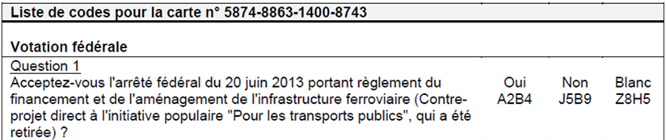
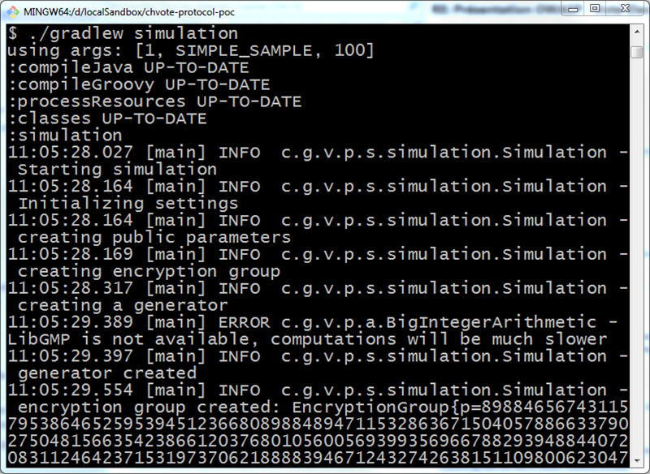

## CHvote

##### PoC of the new Internet Voting protocol

---

## Motivation for the new protocol

* Internet Voting commonly perceived as high risk
* Need to increase trust
  * Vote confidentiality
  * Tally validity
* Also: updated legal bases <!-- .element: class="fragment" -->

---

## Motivation for the PoC

* Validate protocol
* Estimate performance
* Improve internal (State of Geneva) grasp on concepts

---

## Outline

* Context
* Update requirements
* Core protocol concepts
* Implementation overview
* Current results
* Ongoing work

---

## Context - CHvote

* Internet voting system
* 4 referendum / intiatives voting rounds / year
* municipal, cantonal and federal elections
  * usually 2-4 rounds / year
* already in use by several cantons

* developed, hosted and maintained by State of Geneva

---

## Context - Project

* New voting protocol ([BFH](https://e-voting.bfh.ch/))
* PoC implementation (State of Geneva)
* Resulting specification and code have been published
* ETA for usage in production: 2019

---

## Updated requirements > Intro

* New ordinance on Internet Voting (2013, in effect 2014)
    * Technical and administrative requirements
* Compliance levels define allowed electorate percentage
    * 30% / 50% / 100%


See [the website of the Federal Chancellery](https://www.bk.admin.ch/themen/pore/evoting/07979/index.html).

---

## Upd. reqs. > Individual verifiability

> voters must receive proof that the server system has registered the vote as it was entered by the voter on the user 
platform
> – _VEleS, art. 4_

+++

## Upd. reqs. > Individual verifiability



In current version: 
* random codes per voter / response

---

## Upd. Req. > End-to-End encryption

> Votes must not be stored or transmitted in unencrypted form at any time from being entered to tallying.
> – _Technical and administrative requirements, section 3.3.4_

+++

## Upd. Req. > End-to-End encryption

In current version:
* Incompatible with individual verifiability implementation
* Server needs to know vote to return the matching verification code

---

## Upd. Req. > Universal verifiability

> For universal verification, the auditors receive proof that the result has been ascertained correctly. 
> They must evaluate the proof in a observable procedure.
> – _VEleS, art. 5 paragraph 4_

+++

## Upd. Req. > Universal verifiability

In current version:
* Not available
* But external supervision by party representatives holding the private decryption key

---

## Upd. Req. > Control components

> The trustworthy part of the system includes either one or a small number of groups of independent components 
> secured by special measures (control components). 
> Their use must also make any abuse recognisable if per group only one of the control components works correctly and 
> in particular is not manipulated unnoticed. 
> – _VEleS, art. 5, par. 6_

+++

## Upd. Req. > Control components

In current version:
* Application server protected by organisational measures and enforced policies

---

## Core protocol concepts

* El Gamal homomorphic encryption
* Oblivious Transfer for individual verifiability
  * [Cast-as-Intended Verification in Electronic Elections Based on Oblivious Transfer](https://link.springer.com/chapter/10.1007/978-3-319-52240-1_5)
* Pedersen Commitments
* Non-interactive Zero-Knowledge Proofs
* Wikström’s Proof of a Shuffle

---

## Homomorphic encryption

* Allows re-encryptions
  
`$$e = Enc_{pk}(m, r)$$` 
`$$ReEnc_{pk}(e, r') = e \cdot Enc_{pk}(1, r') = Enc_{pk}(m, r + r')$$`
  
* Useful for anonymizing when shuffling

+++ 

## Homomorphic encryption

* Allows for key sharing
  * Control components each hold a key share

---

## Oblivious Transfer

* In short
  * Server knows n secret messages
  * Client allowed to retrieve k secret messages
  * Server cannot know which messages the client asked for
  * Perfect match for the verification codes issue!


* In detail
  * [Cast-as-Intended Verification in Electronic Elections Based on Oblivious Transfer](https://link.springer.com/chapter/10.1007/978-3-319-52240-1_5)

---

## Commitments and ZKPs

* “public” commitments for the secrets
* ZKPs relative to those commitments
* Chain of truth from key generation to ballot decryption


* Combination yields Universal verifiability

---

## Wikström’s Proof of a Shuffle

* Re-encrypting mix-net
  * Since shuffled, simple pre-image proofs would not work
  * Since re-encrypted, ciphertexts are not equal

* Need for a specific proof that the cryptographic shuffle is valid

---

## Implementation - some pointers

###### Algorithms
[ch.ge.ve.protopoc.service.algorithm](https://github.com/republique-et-canton-de-geneve/chvote-protocol-poc/tree/master/src/main/java/ch/ge/ve/protopoc/service/algorithm)

+++ 

## Implementation - some pointers

###### Utilities defined in specification
[ch.ge.ve.protopoc.service.support](https://github.com/republique-et-canton-de-geneve/chvote-protocol-poc/tree/master/src/main/java/ch/ge/ve/protopoc/service/support)

+++

## Implementation - some pointers

###### Simulation-related classes
[ch.ge.ve.protopoc.service.simulation](https://github.com/republique-et-canton-de-geneve/chvote-protocol-poc/tree/master/src/main/java/ch/ge/ve/protopoc/service/simulation)

+++

## Implementation - some pointers

###### Run simulation
```bash
./gradlew simulation
```

---

## Implementation – Snippet

```Java
/**
  * 
  * Algorithm 7.4: GetNIZKPChallenge
  * 
  * @param y     the public values vector (domain unspecified)
  * @param t     the commitments vector (domain unspecified)
  * @param kappa the soundness strength of the challenge 
  * @return the computed challenge 
  */
public BigInteger getNIZKPChallenge(Object[] y, Object[] t, int kappa) {    
    return conversion.toInteger(hash.recHash_L(y, t)).mod(BigIntegers.TWO.pow(kappa));
}
```

+++

## Implementation - Demo



---

## Results: Specification

>[https://ia.cr/2017/325](https://ia.cr/2017/325)
> – _team at [BFH](https://e-voting.bfh.ch/)_

+++

## Results: PoC implementation

* Covers complete protocol (incl. proofs)

* Available on [GitHub](https://github.com/republique-et-canton-de-geneve/chvote-protocol-poc)

* Issues & PRs welcome!

+++

## Result: Performance estimates

* Also available on [GitHub](https://github.com/republique-et-canton-de-geneve/chvote-protocol-poc/blob/master/doc/Performance%20measurements.md)
  * Much better than initially feared
  * 100k ballots could be 
    * Shuffled,
    * Decrypted,
    * & Verified;
    * Using “standard” hardware
    * Within operational time constraints

---

## Soooo… what’s left then?

* GUI &#9786;
* Distribution <!-- .element: class="fragment" -->
  * Real infrastructure for Control Components
* Resilience & Availability <!-- .element: class="fragment" -->
* Custom rules for layout, specific elections, …
* Back-office, test zone, …
* Cantonal interoperability <!-- .element: class="fragment" -->

---

## Questions?

