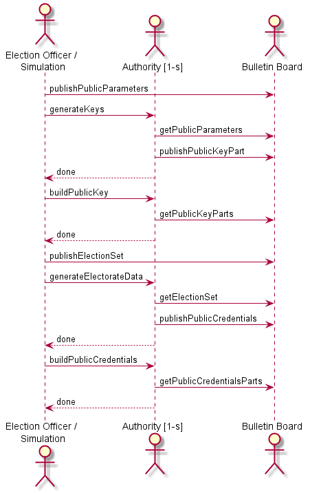
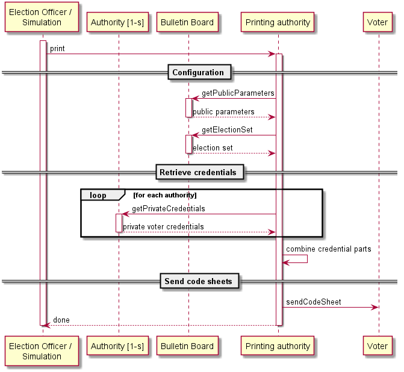
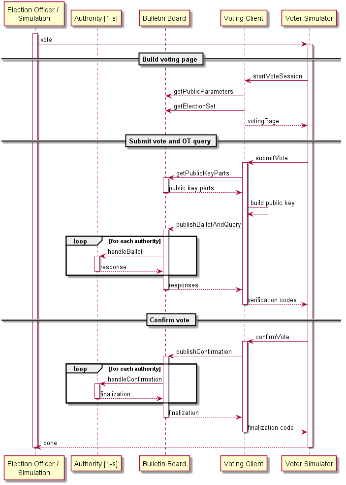
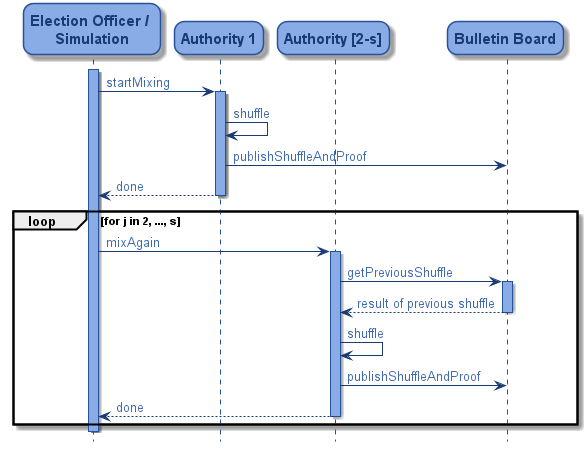
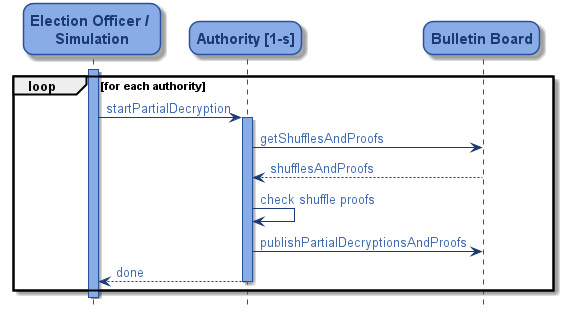
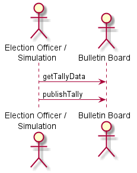

# Concept

## Introduction

The elements outlined in this document are detailed in the specification document provided at [TODO](link).
This document aims to provide a faster overview, which entails some simplification.
The reference document should be used for a better understanding, for clarification of some details or as a reference
when challenging the security of this project.

## Parties and channels

The following parties partake in an election:

- The _election administrator_ is responsible for setting up an election event. 
  This includes tasks such as defining the electoral roll, the number of elections, the set of candidates in each 
  election, and the eligibility of each voter in each election. At the end of the election process, the election 
  administrator determines and publishes the final election result.
- A group of _election authorities_ guarantees the integrity and privacy of the votes submitted
  during the election period. They are numbered with indices j &isin; {1, ..., s}, s &ge; 1.
  Before every election event, they establish jointly a public ElGamal encryption key pk. 
  They also generate the credentials and codes to be printed on the code sheets. 
  During vote casting, they respond to the submitted ballots and confirmations.
  At the end of the election period, they perform a cryptographic shuffle of the encrypted
  votes. Finally, they use their private key shares skj to decrypt the votes in a
  distributed manner.
- The _printing authority_ is responsible for printing the code sheets and delivering them
  to the voters. They receive the data necessary for generating the code sheets from the
  bulletin board and the election authorities.
- The _voters_ are the actual human users of the system. They are numbered with indices
  i &isin; {1, ..., N}, N &ge; 0. Prior to an election event, they receive the code sheet from the
  printing authority, which they can use to cast and confirm a vote during the election
  period using their voting client.  
- The _voting client_ is a machine used by some voter to conduct the vote casting and
  confirmation process. Typically, this machine is either a desktop, notebook, or tablet
  computer with a network connection and enough computational power to perform
  cryptographic computations. The strict separation between voter and voting client is
  an important precondition for the protocol’s security concept.
- The _bulletin board_ is the central communication unit of the system. It implements
  a broadcast channel with memory among the parties involved in the protocol.
  For this, it keeps track of all the messages reveived during the protocol execution.
  The messages from the election administrator and the election authorities are kept in
  separate dedicated sections, which implies that bulletin board can authenticate them
  unambiguously. The entire election data stored by the bulletin board defines the input
  of the verification process.

## Cryptographic primitives

The protocol used in this prototype relies on the following primitives:
 
- El Gamal encryption
- Pedersen commitments
- Oblivious transfer
- Non-Interactive Preimage proofs
- Wikström's Shuffle Proof

## Parameters overview

## Sequence diagrams

This section introduces the sequence diagrams of the simulation process and will need to be adjusted for
real context usage.

### Initialization

### Code sheet printing

### Vote casting phase

### Mixing

### Decryption

### Tallying

